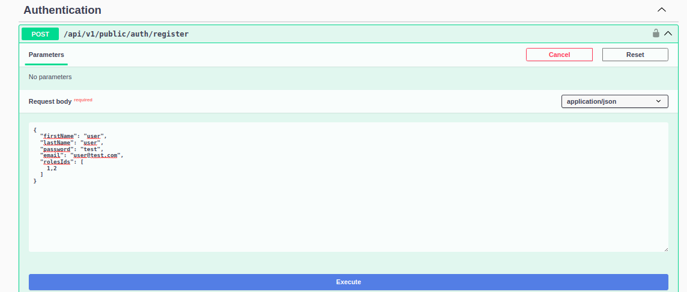

un README.md con una breve descrizione dell'applicativo, istruzioni su come
avviare il progetto, requisiti come il tipo di DBMS e versione di Java / spring,
istruzioni per l'installazione delle dipendenze, indicazioni per l'uso di Docker
Compose (se pertinente), 

e istruzioni per la creazione di un account per
l'accesso. 

Fornisci informazioni chiare e concise per facilitare l'utilizzo e la
collaborazione per il progetto.

# CSV Manager

## Introduzione
This project is a CSV Importer and Exporter.

## Technologies
* Java 17
* Spring Boot 3.3.2
* MySQL 8.3.0
* Docker Compose

## Requirements
* Have installed Java JDK 17
* Have installed Maven 3+
* Have installed Docker and Docker compose newer versions

## Setting up the application
1. Clone the repository: `git clone https://github.com/mbolatti/csvmanager.git`
2. Enter to the _csvmanager_ folder created by the clone action.
3. Run `mvn clean package`

## Execution
```bash
docker-compose up --build
```
   The application will be available in http://localhost:8090

## Using
   The API is managed through Swagger interface on http://localhost:8090/swagger-ui/index.html

### Let's get started

**Warming up**

   If we want to use the API we need to _register a new user_ or _use an existing one_.

   
   **Using an existing one**

   We can use a predefined user to login and get a token.
   The login credencials are user: _test@test.com_ and password: _test_
   
   

**Register a new user**
1. We should register a new user in the _Authentication_ register endpoint



2. Using this payload _(this is a fully functional example, but you can use your own)_. You must complete _firstName_, _lastName_, _password_ and _email_. The _rolesIds_ should remain as _1,2_.
    
   ````json
    {
        "firstName": "user",
        "lastName": "user",
        "password": "test",
        "email": "user@test.com",
        "rolesIds": [
            1,2
        ]
    }
   ````
    
3. As a result we'll get a token and you must copy the _token_ value.


4. After that you must paste the _token_ into the **Authorize** button on top of the Swagger page.
   


After these steps we are ready to start. **Let's go**.

**CSV Stuffs**
   1. **Import CSV files**
   
      Select the file to be uploaded
      
   
      As a result we'll get a list of imports detailing which ones were "ok" and the details of the added record and which ones were "wrong" showing the line, the content and the errors detected.

      
   
   2. **Retrieve Imports**
      As a result we'll get a list of imports
      
   
      

   3. **Export CSV files**

      This feature export the CSV file in the same format as it was imported
   

      We press the _Download file_ button to get the file
   


### Troubleshooting

* If we are getting an **403** error code when we are logged in, it means that the token has expired so then refers to the _Using an existing one_ and make **Logout** and **Authorize** again.


